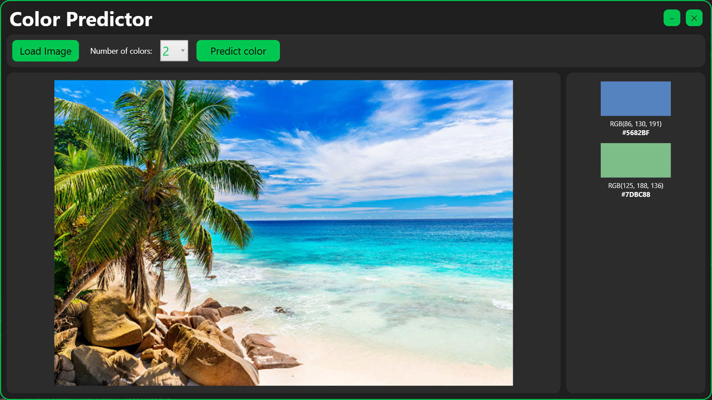

# ColorPredictorApp

**ColorPredictorApp** is a WPF application built on .NET that uses ML.NET to predict the dominant colors in a selected image. The user can load an image, choose the number of colors to predict, and the application will display the results in both RGB and HEX formats.

## Features

- **Image Selection**: Allows the user to load an image in `.jpg` or `.png` format.
- **Color Prediction**: Uses ML.NET models to predict the dominant colors in the image.
- **Result Visualization**: Displays the predicted colors in RGB and HEX format along with color previews.

## System Requirements

- **.NET 8 SDK**: The application requires the .NET 8 SDK to be installed.
- **Operating System**: Windows
- **NuGet Packages**:
  - `Microsoft.ML` (v4.0.2)
  - `Microsoft.ML.FastTree` (v4.0.2)
  - `Microsoft.ML.ImageAnalytics` (v4.0.2)

## Usage

1. Launch the application.
2. Click the **Choose Image** button to load an image.
3. Select the number of colors to predict from the dropdown menu.
4. Click the **Predict** button to display the predicted colors.
5. The results will be shown in both RGB and HEX format, along with visual color previews.

## Project Structure

- **`MainWindow.xaml`**: Defines the user interface.
- **`MainWindow.xaml.cs`**: Contains application logic, including event handling and color prediction.
- **`PredictionResult.cs`**: Class representing a prediction result.
- **`ColorData.cs`**: Input class for ML.NET models.
- **`Models/`**: Folder containing ML models in `.zip` format.

## Example Usage

## License

This project is licensed under the Apache 2.0 License.
